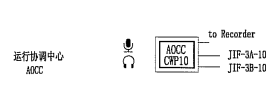

tags:: recording, VCS Console,
next-step:: Look for 2 pairs of copper wires from [[IAMC]] to [[ATC]] Equipment room.

- ### Next Steps
	- TODO Look for 2 pairs of copper wires from [[IAMC]] to [[ATC]] Equipment room.
	  date:: [[2024-12-01 Sun]]
- ## Why
	- [[AOCC]] [[VCS Console]] was located in the room at ATC level 1. Then they asked to move over to [[IAMC]].
	- During the transition, we used a spare [[Console]] port(^^No. 8^^, was `No.12`) in [[VCS]] `Core Switch`.
- ## Ideas
	- ### Options 1 : Just use the former console port ==No.12==
		- #+BEGIN_NOTE
		  No, it will not work. Need a direct connection from [[VCS Console]] to [[Voice Recorder]] 
		  #+END_NOTE
	- ### Options 2: Find out how to connect new port ==No. 8== to Recording System.
		- There are huge amount of connection wires from [[VCS]] core switch to the nearby [[MDF]].
		- It's really hard to find out where and how they were connected for console recording.
		- #+BEGIN_NOTE
		  Unable to find it.
		  #+END_NOTE
- ## Logs
	- ### [[2024-11-04 Mon]]
		- There is a standalone cable from [[VCS Console]] to recorder
			- 3 cables from Console: 1 to recorder, 2 x 'E1` to [[VCS]] core switch.
			- 
			- Ref: [[VCS System Diagram -Built Drawing]]
	- ### [[2024-09-26 Thu]]
		- We haven't found connection of port No.8 to the  `Recording System`.
	-