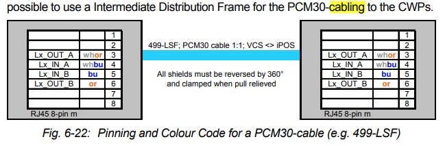
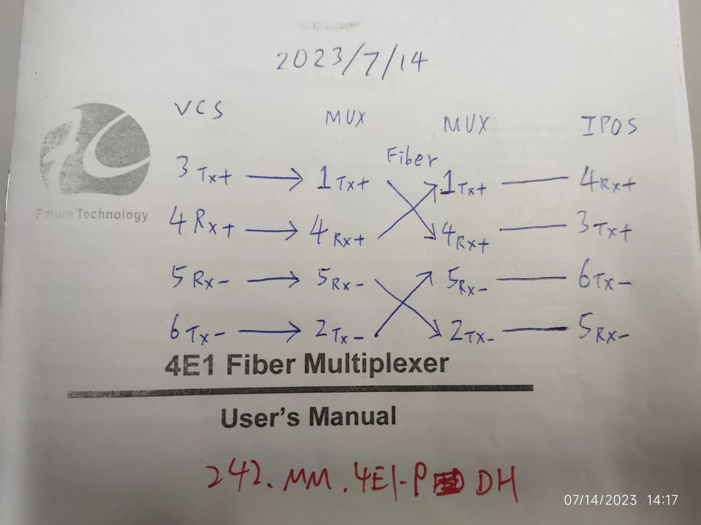
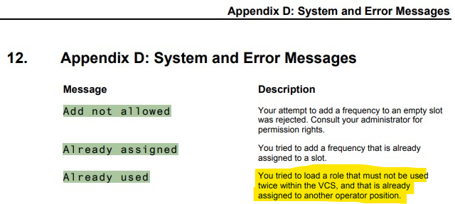

filters:: {"🏠nm tasks & schedule" false}

-
- ## Ongoing
	- ### VCS Console Relocation Proof Of Concept
	  start:: [[2023-03-31 Fri]] 
	  complete:: 
	  status:: ongoing
	  estimated-hours:: 80
	  wo:: CWO23073
	  tags:: cwo, [[cwo.23073]]
	  remark:: Waiting: IMO for new type of E1 to Fiber MUX
		- [[2023-07-05 Wed]] Received 2 x 4E1 Multiplexer
		- ### Ref:
			- E1 Cabling:
				- VCS Core:
				  collapsed:: true
					- 3: Tx +
					- 4: Rx +
					- 5: Rx -
					- 6: Tx -
				- VCS Console:
				  collapsed:: true
					- 3: Tx +
					- 4: Rx +
					- 5: Rx -
					- 6: Tx -
				- PDH Fiber Multiplexer - Future Tech. (杭州飛翔技術)
				  collapsed:: true
					- 1: Tx +
					- 2: Tx -
					- 4: Rx +
					- 5: Rx -
				- RAD Optimux op-30 (Equipment room - Tower)
				  collapsed:: true
					- 1: Rx +
					- 2: Rx -
					- 4: Tx +
					- 5: Tx -
				- Photo
				  collapsed:: true
					- 
					- 
			- ~~A role can ==NOT== be used for more than 1 Console ?~~
			  collapsed:: true
				- From `VCS User's Manual`
				  collapsed:: true
					- 
				- Loaded another `EOC` on the spare console successfully. - [[2023-07-14 Fri]]
					- And both seem to work normally.
		- ### TODOs
			- Material needed
			  done:: #{"{"}
				- TODO VCS Console
				- TODO 16E1 PDH Fiber Multiplexer x 4
				- TODO Handset x 2
				- TODO Fiber Patch
				- TODO LAN Cable Patch
					- 10MT A-to-B patch on Maximo might be useful depending on the actual distance between Console and the socket.
				- TODO Power Strip x 3
				  collapsed:: true
					- 2 Fiber Mux
					- 1 VCS Console
				-
		- ### Logs:
			- [[2023-07-12 Wed]]
				- Use a straight LAN cable to connect spare Console to VCS Core PCM30 slot 8
				- A, B on the back of the Console should be connecting to the corresponding slots on VCS Core PCM30. Otherwise alarm would be activated on related JIFs.
			- [[2023-07-13 Thu]]
				-
- ## Done
	- ### SMG Extend Forecaster Control in PTB NE 3/F
	  start:: [[2023-01-19 Thu]] 
	  status:: done
	  complete:: [[2023-04-03 Mon]] 
	  estimated-hours::
	  tags:: cwo, [[cwo.23011]] 
	  wo:: CWO23011