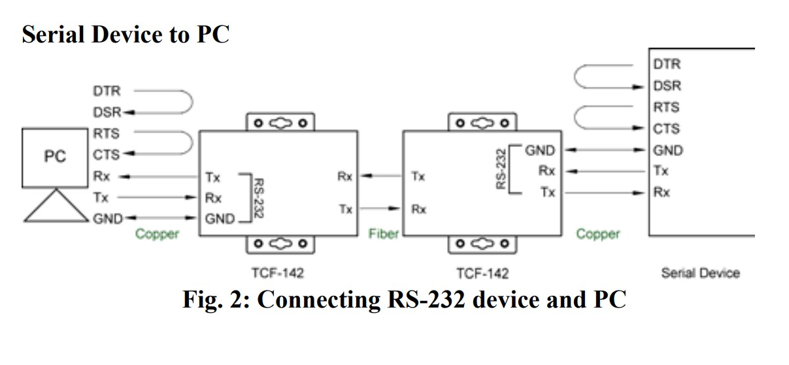
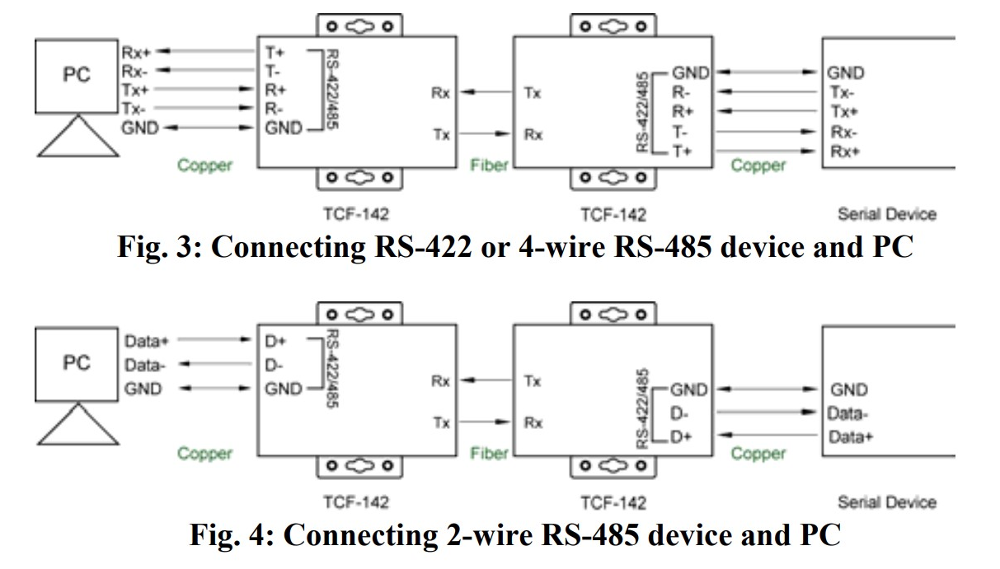

- Data Flow Directions
	- All ==Tx== and ==Rx== are according to MOXA itself.
		- For example: `Rx` on copper side flows into the MOXA, then goes out via `Tx` on Fiber side.
	- 
	- {:height 340, :width 582}