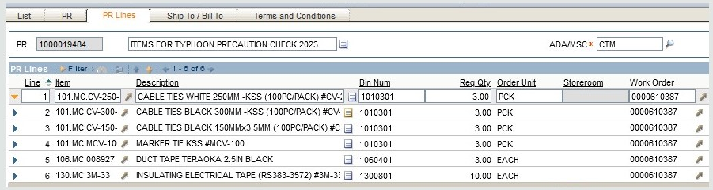

- ## Outstanding Issues
  collapsed:: true
	- TODO [[Flight Check/IGS]] 
	  done:: #{"{"}
	  tags:: outstanding
	  plan:: [[2023-04-20 Thu]]
	  status:: ongoing
	  finished::
	  remark::
	- TODO [[Flight Check/ILS]] 
	  done:: #{"{"}
	  tags:: outstanding
	  plan:: [[2023-04-18 Tue]]
	  status:: ongoing
	  finished::
	  remark::
## Misc
collapsed:: true
	- Solvent Cleaning Pads for AWOS 3-M PM
	  tags:: PR, PR-pending
	  pr:: 1000019512
	  wo:: 0000608964
	  issued:: [[2023-04-11 Tue]] 
	  received::
	- Tower complained that [[HK-CLR]] [[Hotline Interruption]], and other hotlines were good, during monthly PM -[[2023-04-10 Mon]]
		- The only spare [[BCB]] was put in [[ZH-CLR]] for testing
			- ((6433ce1c-0b74-48d4-ba9b-11c1c98f9593))
		- 1. Restore [[ZH-CLR]] to its original
		  2. Replaced [[HK-CLR]] with the only spare [[BCB]]
	- DONE Issue [[IMO]] for 3-meter coaxial cable for ILS ground check 
	  done:: #{"{"}
	  plan:: [[2023-04-10 Mon]]
	  remark:: TS: 610716, https://hken.rs-online.com/web/p/coaxial-cable/1222145
	  finished:: [[2023-04-10 Mon]]
	- Items for `Pre-typhoon Check`
	  tags:: PR, PR-pending
	  pr:: 1000019484
	  wo:: 0000610387
	  issued:: [[2023-04-03 Mon]]
	  received::
		- Cable Ties: (250, 300, 150, MCV-100) x 3,
		- 3M tape x 10,
		- Duct tape x 3.
		- 
	- TODO Update FA36 records, HK trunks changed from E1 to Ethernet 
	  done:: #{"{"}
	  plan:: 
	  remark:: \\10.8.41.8\Data\NM\System 2010\FA36\FA36 (includes Zhuhai and HK route) service assignment.xls
	  finished::
	- TODO Buy capacitor for [[LT31]] blower,  2μF
	  done:: #{"{"}
	  plan:: 
	  remark:: RS: 196-4731
	  collapsed:: true
	  finished::
		- ```
		  - https://hken.rs-online.com/web/p/film-capacitors/1964731
		  - https://hken.rs-online.com/web/p/film-capacitors/1728179
		  - https://hken.rs-online.com/web/p/film-capacitors/3887664
		  ```
	- TODO VCS order printer cartridge 
	  done:: #{"{"}
	  plan:: 
	  finished::
	  remark::
	- TODO [[NM New Staff Training]] 
	  done:: #{"{"}
	  plan:: 
	  finished::
	  remark::
	- TODO SMG NEW AWOS data link to SMG Headquarter 
	  done:: #{"{"}
	  plan:: 
	  remark:: wait for reschedule
	  finished::
		- T]hey changed schedule, was [[2023-03-13 Mon]]
	- TODO `🌀Pre-typhoon Check`, AWOS 
	  done:: #{"{"}
	  plan::
	  finished::
	  remark::
	- TODO `🌀Pre-typhoon Check`, DVOR 
	  done:: #{"{"}
	  plan::
	  finished::
	  remark::
	- TODO `🌀Pre-typhoon Check`, ILS 
	  done:: #{"{"}
	  plan:: [[2023-04-18 Tue]]
	  finished::
	  remark::
	- TODO `🌀Pre-typhoon Check`, IGS 
	  done:: #{"{"}
	  plan:: 
	  finished::
	  remark::
## Monthly PM
	- DONE VCS-m 
	  remark::
	- TODO IGS-m 
	  done:: #{"{"}
	  plan:: [[2023-04-14 Fri]] 
	  remark:: Form. Job on [[2023-04-12 Wed]]
	  finished::
	- TODO FA36-m 
	  done:: #{"{"}
	  plan:: [[2023-04-24 Mon]]
	  finished::
	  remark::
	- ### ILS Monthly PM
		- TODO ILS-m, Record DC Voltages on site 
		  plan::
		  finished::
		  remark::
		- TODO ILS-m, LLZ Ground Check🚓
		- finished:: 
		  remark:: 
		  plan:: [[2023-04-24 Mon]]
		- TODO ILS-m, MIT & Shutdown Tests 
		  done:: #{"{"}
		  plan:: [[2023-04-19 Wed]]
		  finished::
		  remark::
		- TODO ILS-m, Form 
		  done:: #{"{"}
		  plan:: 
		  finished::
		  remark::
	- ### DVOR Monthly PM
		- DONE DVOR-m, Parameter Printout Tx-A 
		  done:: #{"{"}
		  plan:: [[2023-04-06 Thu]]
		  finished:: [[2023-04-06 Thu]]
		  remark::
		- TODO DVOR-m, Site Visit
		  done:: #{"{"}
		  plan:: 
		  finished::
		  remark::
		- TODO DVOR-m, Changeover & Parameter Printout Tx-B 
		  done:: #{"{"}
		  plan:: [[2023-04-24 Mon]]
		  finished::
		  remark::
		- TODO DVOR-m, DC Voltage on ADRACS Tx-B
		  done:: #{"{"}
		  plan::
		  finished::
		  remark::
		- TODO DVOR-m, Form 
		  done:: #{"{"}
		  plan:: 
		  finished::
		  remark::
	- ### AWOS Monthly PM
		- DONE AWOS-m, Windows Cleaning 
		  done:: #{"{"}
		  plan:: [[2023-04-13 Thu]]
		  finished:: [[2023-04-13 Thu]] 
		  remark::
		- TODO AWOS-m, Form 
		  done:: #{"{"}
		  plan:: 
		  finished::
		  remark::
## Weekly PM
collapsed:: true
	- TODO ILS-w, Site Visit 
	  done:: #{"{"}
	  plan::
	  finished::
	  remark::
	- TODO ILS-w, Monitor Printouts 
	  done:: #{"{"}
	  plan::
	  finished::
	  remark::
	- TODO VCS-w, History Logs 
	  done:: #{"{"}
	  plan::
	  finished::
	  remark::
	- TODO `W04` [[Monday Routines]] 
	  done:: #{"{"}
	  plan::
	  finished::
	  remark::
	- TODO ILS-w, Site Visit 
	  done:: #{"{"}
	  plan::
	  finished::
	  remark::
	- TODO ILS-w, Monitor Printouts 
	  done:: #{"{"}
	  plan::
	  finished::
	  remark::
	- TODO VCS-w, History Logs 
	  done:: #{"{"}
	  plan::
	  finished::
	  remark::
	- TODO `W03` [[Monday Routines]] 
	  done:: #{"{"}
	  plan::
	  finished::
	  remark::
	- DONE ILS-w, Site Visit 
	  done:: #{"{"}
	  plan:: [[2023-04-12 Wed]] 
	  finished:: [[2023-04-12 Wed]] 
	  remark::
	- TODO ILS-w, Monitor Printouts 
	  done:: #{"{"}
	  plan:: [[2023-04-14 Fri]] 
	  finished::
	  remark::
	- DONE VCS-w, History Logs 
	  done:: #{"{"}
	  plan:: [[2023-04-10 Mon]]
	  finished:: [[2023-04-10 Mon]]
	  remark::
	- DONE `W02` [[Monday Routines]] 
	  done:: #{"{"}
	  plan::
	  finished::
	  remark::
	- DONE ILS-w, Site Visit 
	  done:: #{"{"}
	  plan:: [[2023-04-04 Tue]]
	  finished:: [[2023-04-04 Tue]]
	  remark::
	- DONE ILS-w, Monitor Printouts 
	  done:: #{"{"}
	  plan:: [[2023-04-04 Tue]]
	  finished:: [[2023-04-04 Tue]]
	  remark::
	- DONE VCS-w, History Logs 
	  done:: #{"{"}
	  plan:: [[2023-04-04 Tue]]
	  finished:: [[2023-04-04 Tue]]
	  remark::
	- DONE `W01` [[Monday Routines]] 
	  done:: #{"{"}
	  plan::
	  finished::
	  remark::
## x-Monthly Routines
	- ## ✈️Flight Check `IGS`
	  collapsed:: true
		- DONE ✈️Flight Check `IGS` Pre 
		  done:: #{"{"}
		  plan:: [[2023-04-12 Wed]]
		  remark:: Field Test Set
		  finished:: [[2023-04-12 Wed]]
		- TODO ✈️Flight Check `IGS` In-progress 
		  done:: #{"{"}
		  plan:: [[2023-04-20 Thu]]
		  finished::
		  remark::
		- TODO ✈️Flight Check `IGS` Post
		  done:: #{"{"}
		  plan::
		  finished::
		  remark::
	- ## ✈️Flight Check `ILS`
		- DONE ✈️Flight Check `ILS` Pre 
		  done:: #{"{"}
		  plan:: [[2023-04-03 Mon]]
		  finished:: [[2023-04-03 Mon]]
		  remark::
		- DONE ✈️Fl️ight Check `ILS` Connect Fiber Link `LLZ` to `GP` 
		  done:: #{"{"}
		  plan:: [[2023-04-13 Thu]] 
		  finished:: [[2023-04-13 Thu]] 
		  remark::
		- TODO ✈️Flight Check `ILS` In-progress 
		  done:: #{"{"}
		  plan:: [[2023-04-18 Tue]]
		  finished::
		  remark::
		- TODO ✈️Flight Check `ILS` Post, Param Printout Tx-A 
		  done:: #{"{"}
		  plan:: [[2023-04-24 Mon]] 
		  finished::
		  remark::
		- TODO ✈️Flight Check `ILS` Post, Param Printout Tx-B 
		  done:: #{"{"}
		  plan::
		  finished::
		  remark::
		- TODO ✈️Flight Check `ILS` Post, LLZ Ground Check Points
		  done:: #{"{"}
		  plan::
		  finished::
		  remark::
		- TODO ✈️Flight Check `ILS` Form 
		  done:: #{"{"}
		  plan::
		  finished::
		  remark::
	- ### ILS 3-Monthly PM -From [[Monthly/2023-02]]
		- TODO ILS-3m, LLZ & GP Power Measurements 
		  done:: #{"{"}
		  plan:: 
		  remark:: Lack of 1w power sensors
		  finished::
		- TODO ILS-3m, Form 
		  done:: #{"{"}
		  plan:: 
		  finished::
		  remark::
	- ### DONE AWOS 3-Monthly PM
	  collapsed:: true
		- DONE AWOS-3m, [[ATIS Changeover -Steps]] 
		  done:: #{"{"}
		  id:: 643506f5-9411-4692-ab3b-43affc12a8e8
		  plan:: [[2023-04-11 Tue]]
		  remark:: 3 minutes interruption
		  finished:: [[2023-04-11 Tue]]
		- DONE AWOS-3m, Workstation Disk Storage Check
		  done:: #{"{"}
		  plan:: [[2023-04-06 Thu]]
		  finished:: [[2023-04-06 Thu]]
		  remark::
		- DONE AWOS-3m, Form
		  done:: #{"{"}
		  finished:: [[2023-04-11 Tue]] 
		  plan::
		  remark::
	- ### AWOS 6-Monthly PM
		- DONE AWOS-6m, LT31 Calibration
		  done:: #{"{"}
		  plan:: [[2023-04-13 Thu]]
		  finished:: [[2023-04-13 Thu]] 
		  remark::
		- DONE AWOS-6m, [[PWD Calibration]]
		  remark::
		- TODO AWOS-6m, Form
		  done:: #{"{"}
		  plan:: [[2023-04-26 Wed]] 
		  finished::
		  remark::
	- ### AWOS Yearly PM
		- DONE AWOS-yearly, LM21 Calibration
		  done:: #{"{"}
		  plan:: [[2023-04-13 Thu]] 
		  finished:: [[2023-04-13 Thu]] 
		  remark::
		- TODO AWOS-yearly, FD12P Calibration
		  done:: #{"{"}
		  plan::
		  finished::
		  remark::
		- TODO AWOS-yearly, FD12P TS 0℃
		  done:: #{"{"}
		  remark:: Prepare ice bricks in advance
		  plan::
		  finished::
		- TODO AWOS-yearly, Battery Condition Check
		  done:: #{"{"}
		  plan::
		  finished::
		  remark::
		- TODO AWOS-yearly, Temp & Humidity Check
		  done:: #{"{"}
		  plan:: [[2023-04-26 Wed]] 
		  finished::
		  remark::
		- TODO AWOS-yearly, Pressure Check
		  done:: #{"{"}
		  plan:: [[2023-04-26 Wed]] 
		  finished::
		  remark::
		- TODO AWOS-yearly, Form
		  done:: #{"{"}
		  plan::
		  finished::
		  remark::
## TS
	- DONE [[Site Cleaning]] (2nd Wed.) 
	  done:: #{"{"}
	  plan:: [[2023-04-12 Wed]] 
	  finished:: [[2023-04-12 Wed]] 
	  remark::
	- TODO Workplace Safety -ISO45001 ==FCOHSP 9.1.1-03==
	  done:: #{"{"}
	  plan:: [[2023-04-24 Mon]]
	  finished::
	  remark::
## End of Month
collapsed:: true
	- TODO [[Review CM Status & Send Email]]
	  plan::
	  finished::
	  remark::
		- TODO Verify `Failure Code` is present on every CM.
- ## DONE Start of Month
  collapsed:: true
	- DONE Verify `AWOS` daily backup logs. (Soft link on maintenance PC to TCD workstation)
	- DONE Check `PM Incomplete from Last Month` on Maximo
	- DONE Complete PM last month
	- DONE Complete TS las month
	- DONE Complete CM
	- DONE Initiate PM (Choose multiple W.O. -> "Select Records")
	- DONE Arrange Dates for PMs of The Month
	-
## Future Issues (To move over)
	- TODO [[Karl]] on [[AL]] 
	  done:: #{"{"}
	  plan:: [[2023-05-18 Thu]] 
	  finished::
	  remark::
	- TODO [[Karl]] on [[AL]] 
	  done:: #{"{"}
	  plan:: [[2023-05-19 Fri]] 
	  finished::
	  remark::
	- TODO [[Eric]] on [[AL]] 
	  done:: #{"{"}
	  plan:: [[2023-05-10 Wed]] 
	  finished::
	  remark::
	- TODO [[Eric]] on [[AL]] 
	  done:: #{"{"}
	  plan:: [[2023-05-11 Thu]] 
	  finished::
	  remark::
	- TODO [[Eric]] on [[AL]] 
	  done:: #{"{"}
	  plan:: [[2023-05-12 Fri]] 
	  finished::
	  remark::
	- TODO HK [[Audit]] [[ISO45001]]
	  done:: #{"{"}
	  plan:: [[2023-05-30 Tue]]
	  finished::
	  remark::
## Members Absent
	- DONE [[Nick]] joins [[CTM]] introduction 
	  done:: #{"{"}
	  plan:: [[2023-04-13 Thu]]
	  finished:: [[2023-04-13 Thu]] 
	  remark::
	- DONE [[Nick]] AM out for errend 
	  done:: #{"{"}
	  plan:: [[2023-04-11 Tue]]
	  finished::
	  remark::
	- DONE [[Karl]] ISO45001 course at E&M 
	  done:: #{"{"}
	  plan:: [[2023-04-04 Tue]]
	  finished:: [[2023-04-04 Tue]]
	  remark::
	- DONE [[Joe]] AM [[AL]] 
	  done:: #{"{"}
	  plan:: [[2023-04-03 Mon]]
	  finished:: [[2023-04-03 Mon]] 
	  remark::
- ---
- # Test query
  collapsed:: true
	- TESTING task -today
	  done:: #{"{"}
	  plan:: [[2023-04-10 Mon]]
	  finished::
	  remark::
	- TESTING task -yesterday
	  done:: #{"{"}
	  plan:: [[2023-04-09 Sun]]
	  finished::
	  remark::
	  :LOGBOOK:
	  CLOCK: [2023-04-10 Mon 10:37:57]
	  :END:
- [[Comments]]
  collapsed:: true
	- [[2023-04-11 Tue]]
		- ((643506f5-9411-4692-ab3b-43affc12a8e8))
			- The software shows and error prompt, saying "...RWY IN USE hotswap.txt file is used by another process. Press 'continue' or 'quit'...." on standby PC.
			- We did not noticed at the moment that the software did not act normally at that moment.
			- We stopped the active one and wait for this standby one to turn active. But nothing happened after about 4 minutes.
			- So we exited the software and rebooted the PC.
			- After that, we started the software and it took over active after about 2 minutes.
			- #lesson Verify the standby ATIS works normally before doing a changeover.
	- [[2023-04-13 Thu]]
	  collapsed:: true
		- ((643506f5-edfb-47ba-96a2-517786ef273f))
			- [[PWD]] [[RWY34]] `CHECK` 531, failed.
			- Calibrator factor 563, ±5% limit.
			- `CAL 563` command failed: "Calibration Ignored"
			- Tried `CAL 540` succeeded.
			- `CHECK` read 538, within limit.