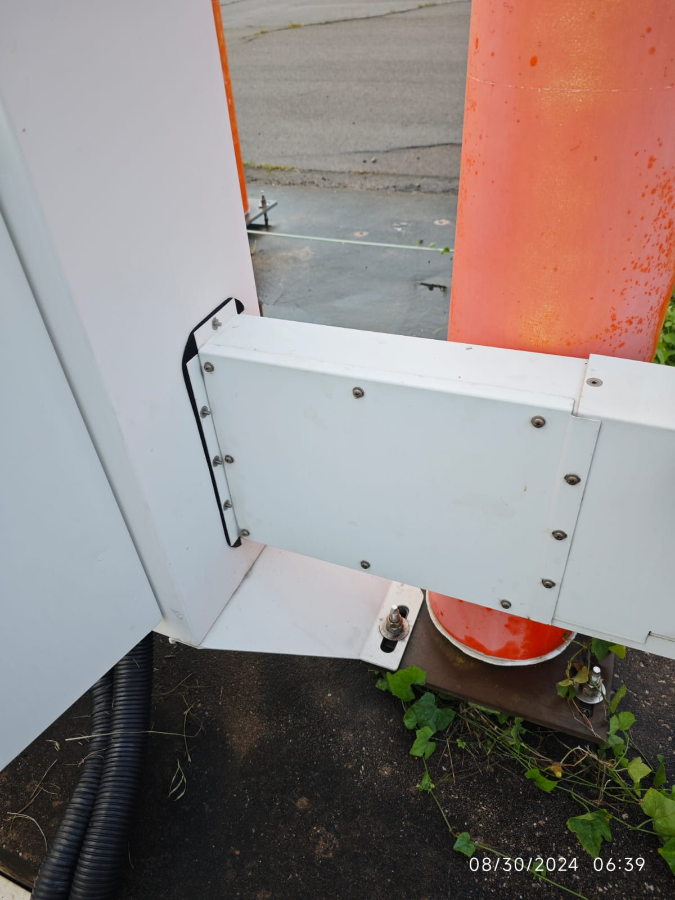
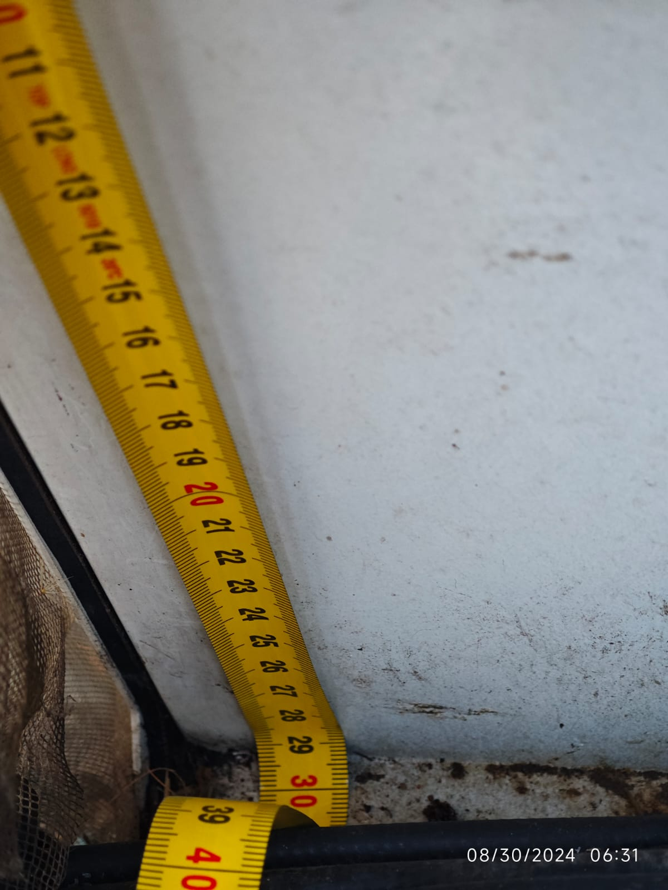
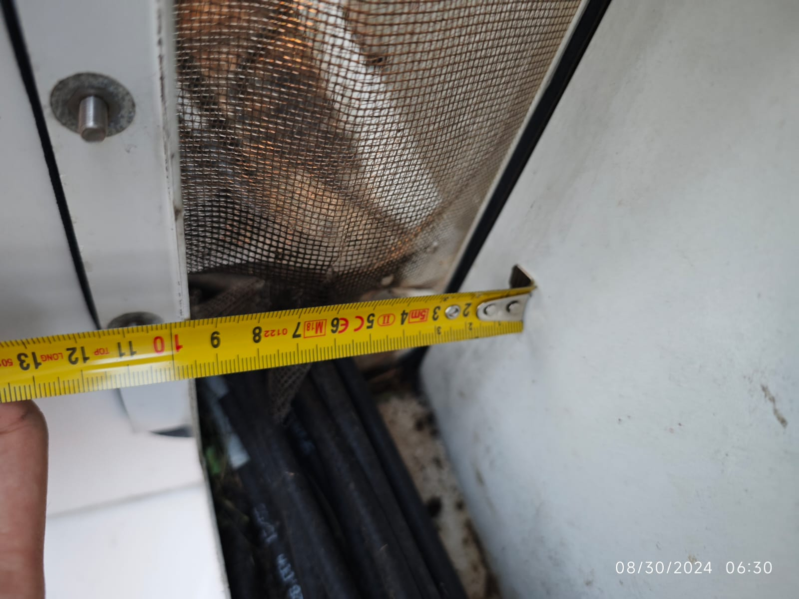
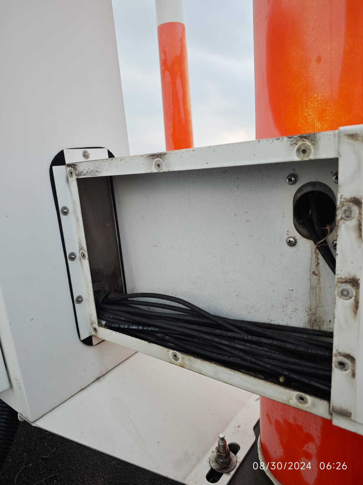
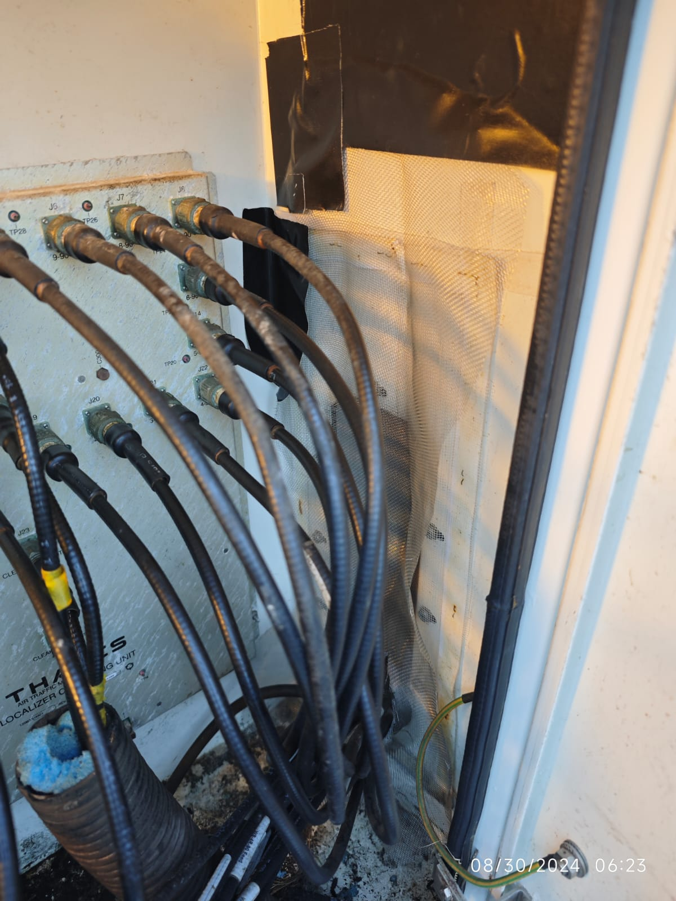
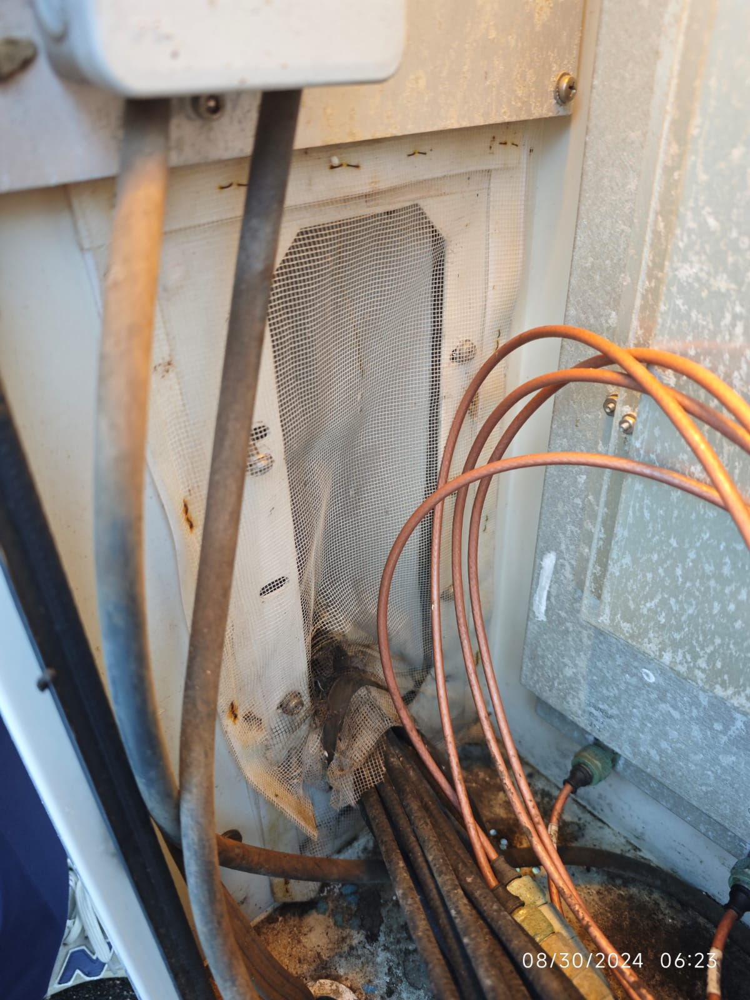

- [Last Month]([[Monthly/2024-11]]) << | >> [Next Month]([[Monthly/2025-01]])
- ## 📌Outstanding {{renderer :todomaster}}
- ## Tasks and Issues of the Month {{renderer(:todomaster)}}
  collapsed:: true
	- TODO 3M Tape x 2 
	  tags:: PR, PR-pending
	  pr:: 1000022236
	  wo:: 655533
	  issued:: [[2024-12-09 Mon]]
	  remark:: Out of stocks, used LOC Farfiled Antenna CM to order 2 pcs.
	  received::
	- [[LOC Farfiield Antenna]] lower mounting was displaced
	  date:: [[2024-12-06 Fri]]
	- [[New AWOS Server UPS Battery Replacement]]
	- DONE Replace Batteries [[LOC]]
	  date:: [[2024-12-06 Fri]]
	- TODO Replace Batteries [[GP]]
	  date:: [[2024-12-10 Tue]]
	- DONE Replace Batteries [[DVOR]]
	  date:: [[2024-12-09 Mon]]
	- DONE To Dispose: Unknown PC in ATC warehouse -ATC Training Pos. Old AWOS VM
	  date:: [[2024-12-09 Mon]]
	  wo:: 655960
	  remark:: It was found in ATC warehouse by auditor of ISO27001. Issued DIR to dispose it.
	- DONE GP Tower Painting, [[Nick]] drives [[Platform Truck🚛]] 
	  date:: [[2024-11-08 Fri]]
	  remark:: NOTAM 6:00am - 13:00pm. TWA 6 - 14pm. It was supposed to use platform truck for GP painting. But with strong wind, truck was useless. 3 coworkers climb the ladder to paint.
	- DONE Preparing for 2-week [[AL]] #Aaron 
	  date:: [[2024-11-13 Wed]]
		- DONE PM schedule for 1st week of [[Monthly/2024-12]]
		- DONE Send out `On Leave` email
		-
	- DONE [[Vaisala]] 2 engineers came, Fix 'histmon' function on workstation
	  date:: [[2024-11-13 Wed]]
	- DONE [[AOCC VCS Console in IAMC Recording Issue]]
	  date:: [[2024-11-12 Tue]]
	- TODO New staffs to record signal spectrum
	  done:: #{"{"}
	  date:: [[2024-12-13 Fri]]
	  remark:: The [[Spectrum Analyzer]] was sent out for calibration
		- Outside at ATC 7th floor? RC antenna on top of ATC?
	- TODO [[LOC]] [[ADU]] -Fixing the net & clean the cabinet 
	  done:: #{"{"}
	  date::
	  next-step:: Acrylic + silicone sealant
	  remark:: Holes dimensions: 29.5 x 9.7 cm
		- DONE Buy 2 x 玻璃膠 silicone sealant
		  done:: #{"{"}
		  date:: [[2024-08-29 Thu]]
		  finish::
		  remark:: Bought 1 pic after lunch.
		- [[2024-08-30 Fri]] =Failed== to fix the iron net, neither with tape or 玻璃膠.
		- DONE To buy 2 x Acrylic(亞克力) (10 x 30cm) sheets from Taobao
		- Photos
		  collapsed:: true
			- 
			- 
			- 
			- 
			- 
			- 
	- TODO Install new [[AWOS]] workstation at [[SMG]]
	  date:: [[2025-01-01 Wed]]
	  remark:: Make visit appointment. received on [[2024-10-14 Mon]]. Do some tests for a couple of weeks before installation.
	- DONE Fix the holders of [[LCP Battery]] on [[LOC]] & [[GP]] with AB Gel
	  done:: #{"{"}
	  date:: [[2024-10-30 Wed]]
	  remark:: Ref: ((66ced2fc-bc6d-4711-b403-dd77c02410ae))
	- DONE Prepare connector on [[2024-08-08 Thu]]
	- TODO Review ILS [[Training]] materials from [[Eric]] in [[ZhangJiaJie]] #aaron
	  date:: [[2024-12-02 Mon]]
	  remark:: Copied doc to vWork on [[2024-11-06 Wed]]
	- TODO Buy some PCB handles @[[TaoBao]]
	  date::
	  tags:: pending, to-buy,
	  remark:: Handles were broken on GP DME `TBI` Board
	  created:: [[2024-09-03 Tue]]
	- TODO [[VCS]] [[TMCS]] server backup and replace HDD 
	  done:: #{"{"}
	  date::
	  remark::
	- TODO [[VCS]] update [[MDF]] records for VHF channels 
	  done:: #{"{"}
	  date::
	  remark:: [File on Google Drive](https://docs.google.com/spreadsheets/d/16JhpwpNvPlRxEAC7VNuOSlVX0hVfVapj)
		- This file might be better to put on [[vWork]] or internal server.
	- TODO Replace [[Wind]] [[Obstruction Light]] [[RWY34]]
	  done:: #{"{"}
	  date:: [[2024-12-16 Mon]]
	  remark:: Obstruction Light connector & cable connector are both male.
		- Installed [[Obstruction Light]] on [[2024-11-27 Wed]]
		- TODO Install connector and connect to power.
		- DONE Prepare connector on [[2024-08-08 Thu]]
	- TODO Buy red paint for [[LOC]] [[Ground Check]] points
	  done:: #{"{"}
	  date:: [[2025-02-01 Sat]]
	  tags:: pending, to-buy
	  created:: [[2024-09-04 Wed]]
	  remark::
		- Repaint the markings on [[Runway]] in Feb-2025
	- DONE [[IGS]] Gen logs of 2024-11 in order to submit all PM records of the month earlier.
	  date:: [[2024-12-05 Thu]]
- ## Weekly PM {{renderer :todomaster}}
  collapsed:: true
	- DONE [[Monday Routines]] #w01 #aaron 
	  done:: #{"{"}
	  date:: [[2024-12-03 Tue]]
	- DONE [[ILS]] `Weekly`, 📄Monitor Printouts #w01
	  date:: [[2024-12-04 Wed]]
	- DONE [[VCS]] `Weekly` #w01
	  date:: [[2024-12-03 Tue]]
	- DONE [[ILS]] `Weekly` ,  🏠️Site Visit #w01
	  done:: #{"{"}
	  date:: [[2024-12-02 Mon]]
	- DONE  ==Weekly PM Plan== #w01 #aaron 
	  date:: [[2024-12-05 Thu]]
	- DONE [[Monday Routines]] #w02 #aaron 
	  done:: #{"{"}
	  date:: [[2024-12-09 Mon]]
	- TODO  [[ILS]] `Weekly`, 📄Monitor Printouts  #w02
	  date:: [[2024-12-10 Tue]]
	- TODO  [[VCS]] `Weekly` #w02
	  date:: [[2024-12-10 Tue]]
	- TODO  [[ILS]] `Weekly` ,  🏠️Site Visit #w02
	  done:: #{"{"}
	  date:: [[2024-12-11 Wed]]
	- TODO  ^^Weekly PM Plan^^ #w02 #aaron 
	  date:: [[2024-12-12 Thu]]
	- TODO [[Monday Routines]] #w03 #aaron 
	  done:: #{"{"}
	  date:: [[2024-12-16 Mon]]
	- TODO [[ILS]] `Weekly`, 📄Monitor Printouts #w03 
	  date:: [[2024-12-16 Mon]]
	- TODO [[VCS]] `Weekly` #w03
	  date:: [[2024-12-17 Tue]]
	- TODO [[ILS]] `Weekly` ,  🏠️Site Visit #w03
	  done:: #{"{"}
	  date:: [[2024-12-18 Wed]]
	- TODO ^^Weekly PM Plan^^ #w03 #aaron 
	  date:: [[2024-12-19 Thu]]
	- TODO [[Monday Routines]] #w04 #aaron 
	  done:: #{"{"}
	  date:: [[2024-12-26 Thu]]
	- TODO [[ILS]] `Weekly`, 📄Monitor Printouts #w04
	  date:: [[2024-12-27 Fri]]
	- TODO [[VCS]] `Weekly` #w04
	  date:: [[2024-12-26 Thu]]
	- TODO [[ILS]] `Weekly` ,  🏠️Site Visit #w04
	  done:: #{"{"}
	  date:: [[2024-12-26 Thu]]
	- TODO ^^Weekly PM Plan^^ #w04 #aaron 
	  date:: [[2024-12-26 Thu]]
	- TODO [[Monday Routines]] #w05 #aaron 
	  done:: #{"{"}
	  date:: [[2024-12-30 Mon]]
	- TODO [[ILS]] `Weekly`, 📄Monitor Printouts #w05 
	  date:: [[2024-12-30 Mon]]
	- TODO [[VCS]] `Weekly` #w05
	  date:: [[2024-12-30 Mon]]
	- TODO [[ILS]] `Weekly` ,  🏠️Site Visit #w05
	  done:: #{"{"}
	  date:: [[2024-12-31 Tue]]
	- TODO ^^Weekly PM Plan^^ #w05 #aaron 
	  date:: [[2025-01-02 Thu]]
- ## Monthly PM {{renderer :todomaster}}
  collapsed:: true
	- ### [[VCS]] Monthly PM {{renderer :todomaster}}
	  labor:: 24 hours
		- DONE [[VCS]] `Monthly` - 📞Line check & Save config
		  done:: #{"{"}
		  date:: [[2024-12-03 Tue]]
		  labor::  4 x 4 hours
		- DONE [[VCS]] `Monthly` -==Form== 
		  done:: #{"{"}
		  date:: [[2024-12-05 Thu]]
		  labor::  2 x 4 hours
	- ### [[IGS]] Monthly PM {{renderer :todomaster}}
	  labor:: 32 hours
		- TODO [[IGS]] `Monthly` PM - 🏠️Site
		  done:: #{"{"}
		  date:: [[2024-12-11 Wed]]
		  labor:: 4 x 4 hours
		- TODO [[IGS]] `Monthly` -==From== 
		  done:: #{"{"}
		  date:: [[2024-12-13 Fri]]
		  labor::  4 x 4 hours
	- ### TODO [[FA36]] monthly 
	  done:: #{"{"}
	  date:: [[2024-12-26 Thu]]
	  labor:: 16 hours
	- ### [[ILS]] Monthly PM {{renderer :todomaster}}
	  labor:: 32 hours
		- TODO [[ILS]] -`Monthly`, Record DC Voltages on site 
		  done:: #{"{"}
		  date:: [[2024-12-10 Tue]]
		- DONE [[ILS]]-`Monthly`, Battery Voltages on site 
		  done:: #{"{"}
		  date:: [[2024-12-02 Mon]]
		  labor:: 1 x 4 hours
		- DONE [[ILS]] `Monthly`, LOC Ground Check 
		  done:: #{"{"}
		  date:: [[2024-12-06 Fri]]
		  labor:: 4 x 4 hours
		- DONE [[ILS]] `Monthly`, MIT & Shutdown Tests 
		  done:: #{"{"}
		  date:: [[2024-12-06 Fri]]
		  labor:: 4 x 4 hours
		- TODO [[ILS]] -`Monthly`, Sync Date/Time on `RCSE` 
		  done:: #{"{"}
		  date:: [[2024-12-13 Fri]]
		- TODO [[ILS]] `Monthly`, ==Form== 
		  done:: #{"{"}
		  date:: [[2024-12-13 Fri]]
	- ### [[DVOR]] Monthly PM {{renderer :todomaster}}
	  labor:: 16 hours
		- DONE [[DVOR]] `Monthly`, Site Visit
		  done:: #{"{"}
		  date:: [[2024-12-02 Mon]]
		  labor:: 1 x 4 hours
		- DONE [[DVOR]] `Monthly`, Changeover & Parameter Printouts
		  done:: #{"{"}
		  date:: [[2024-12-09 Mon]]
		  labor:: 4 x 4 hours
			- TODO 1. Parameter Printout -A
			- TODO 2. Changeover
			- TODO 3. Parameter Printout -B
			- TODO 4. Record DC Voltage on ADRACS
	- ### [[AWOS]] Monthly PM {{renderer :todomaster}}
	  labor:: 48 hours
		- TODO [[AWOS]] `Monthly`, Windows Cleaning -Platform Truck🚛
		  done:: #{"{"}
		  date:: [[2024-12-16 Mon]]
		  laobr:: 4x 8 hours
		- TODO [[AWOS]] `Monthly`, Ground Equipment
		  done:: #{"{"}
		  date:: 
		  labor:: 4 x 4 hours
		- TODO [[AWOS]] `Monthly`, ==Form== 
		  done:: #{"{"}
		  date:: 
		  labor:: 4 x 4 hours
- ## ❌-Monthly Routines {{renderer :todomaster}}
- ## TS {{renderer :todomaster}}
	- TODO [[Site Cleaning]] (2nd Wednesday) 
	  done:: #{"{"}
	  date:: [[2024-12-11 Wed]]
	- TODO ⛑️Workplace Safety -ISO45001 `FCOHSP 9.1.1-03`
	  done:: #{"{"}
	  date:: [[2024-12-27 Fri]]
	- TODO 🪜Ladder & Tools Check `FCOHSP 9.1.1-04` (==Odd Months Only==) 
	  done:: #{"{"}
	  date::
- ## End of Month {{renderer :todomaster}}
  collapsed:: true
	- TODO Generate PM schedule📅 for the coming month
	  done:: #{"{"}
	- TODO Check [[Calibration Records]] for next month
	  done:: #{"{"}
	- TODO [[Review CM Status]]
	  
	  remark:: Verify `Failure Code` is present on every CM.
- ## Start of Month {{renderer :todomaster}}
	- DONE Initialize ==Daily PMs== on [[Maximo]]
	- DONE Verify `AWOS` daily backup logs. (Soft link on maintenance PC to TCD workstation)
	- DONE Check `PM Incomplete from Last Month` on Maximo
	- DONE Complete PM last month
	- DONE Complete TS las month
	- DONE Complete CM
	- DONE Initiate PM (Choose multiple W.O. -> "Select Records")
	- DONE Arrange Dates for PMs of The Month
- ## Future Issues (==To move over==)
  collapsed:: true
	- TODO Install [[FD70]]
	  date:: [[2025-02-01 Sat]]
	- TODO Replace foundation of [[LT31]] receiver on [[RWY16]]
	  date:: [[2025-06-01 Sun]]
	- TODO [[Audit#ISO 45001]]
	  date:: [[2025-02-16 Sun]]
- ## Members Absent {{renderer :todomaster}}
	- DONE [[Eric]] on [[CL]]
	  date:: [[2024-12-04 Wed]]
	- DONE [[Vincent]] on [[ATSEP]] [[Training]] From [[2024-12-02 Mon]] to [[2024-12-05 Thu]]
	- DONE [[Nick]] on [[ATSEP]] [[Training]]
	  date:: [[2024-12-04 Wed]]