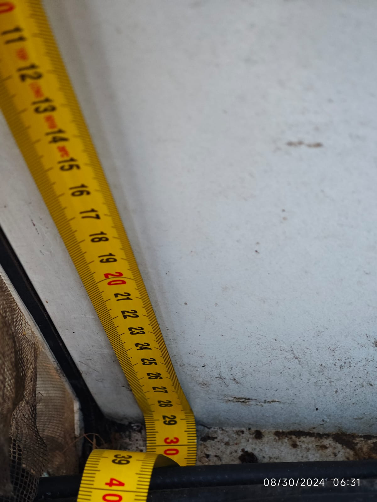
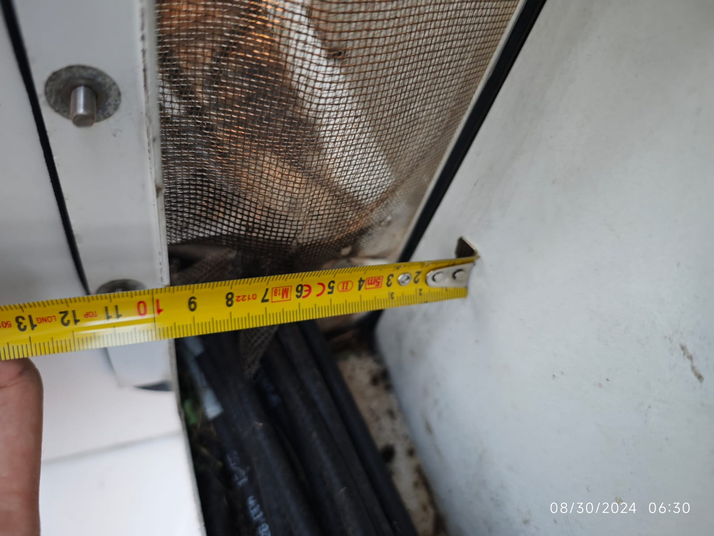
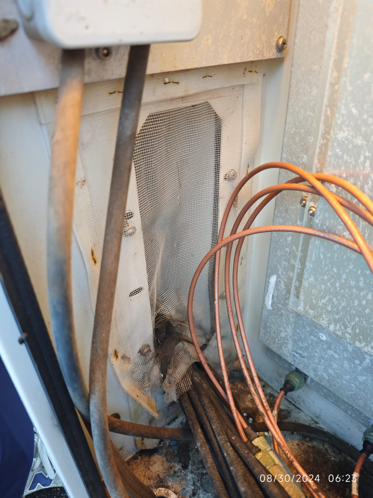

- [Last Month]([[Monthly/2024-12]]) << | >> [Next Month]([[Monthly/2025-02]])
- ## 📌Outstanding {{renderer :todomaster}}
- ## Tasks and Issues of the Month {{renderer :todomaster}}
  collapsed:: true
	- TODO [[Internal Training Plan - 2025]]
	- TODO [[Replace CR2032 on IGS LOC]] during downtime
	  date:: [[2025-01-08 Wed]]
		- TODO Buy `CR2032` battery for IGS
		  date:: [[2025-01-03 Fri]]
	- TODO [[Audit#ISO14000]]
	  date:: [[2025-01-06 Mon]]
	  remark:: & [[2025-01-07 Tue]]
	- TODO Old batteries on [[Runway]] sites to be recycling
	  date:: [[2025-01-06 Mon]]
		- DONE Ask [[Angus]] to arrange with [[CAM]] 
		  date:: [[2024-12-11 Wed]]
		  remark:: total 28 pcs.
	- TODO [[LOC Farfiield Antenna]] lower mounting was displaced
	  date:: [[2025-01-06 Mon]]
	- TODO [[LOC]] [[ADU]] -Fixing the net & clean the cabinet 
	  done:: #{"{"}
	  date:: [[2025-02-03 Mon]]
	  next-step:: Acrylic + silicone sealant
	  remark:: Holes dimensions: 29.5 x 9.7 cm
		- DONE Buy 2 x 玻璃膠 silicone sealant
		  done:: #{"{"}
		  date:: [[2024-08-29 Thu]]
		  finish::
		  remark:: Bought 1 pic after lunch.
		- [[2024-08-30 Fri]] =Failed== to fix the iron net, neither with tape or 玻璃膠.
		- DONE To buy 2 x Acrylic(亞克力) (10 x 30cm) sheets from Taobao
		- Photos
		  collapsed:: true
			- 
			- 
			- 
			- 
			- 
			- 
	- TODO Install new [[AWOS]] workstation at [[SMG]]
	  date:: [[2025-01-06 Mon]]
	  remark:: Make visit appointment. received on [[2024-10-14 Mon]]. Do some tests for a couple of weeks before installation.
	- TODO Review ILS [[Training]] materials from [[Eric]] in [[ZhangJiaJie]] #aaron
	  date:: [[2024-12-02 Mon]]
	  remark:: Copied doc to vWork on [[2024-11-06 Wed]]
	- TODO Buy some PCB handles @[[TaoBao]]
	  date::
	  tags:: pending, to-buy,
	  remark:: Handles were broken on GP DME `TBI` Board
	  created:: [[2024-09-03 Tue]]
	- TODO [[VCS]] [[TMCS]] server backup and replace HDD 
	  done:: #{"{"}
	  date::
	  remark::
	- TODO [[VCS]] update [[MDF]] records for VHF channels 
	  done:: #{"{"}
	  date::
	  remark:: [File on Google Drive](https://docs.google.com/spreadsheets/d/16JhpwpNvPlRxEAC7VNuOSlVX0hVfVapj)
		- This file might be better to put on [[vWork]] or internal server.
	- TODO Buy red paint for [[LOC]] [[Ground Check]] points
	  done:: #{"{"}
	  date:: [[2025-02-03 Mon]]
	  tags:: pending, to-buy
	  created:: [[2024-09-04 Wed]]
	  remark::
		- Repaint the markings on [[Runway]] in Feb-2025
- ## Weekly PM {{renderer :todomaster}}
  collapsed:: true
	- DONE [[Monday Routines]] #w01 #aaron 
	  done:: #{"{"}
	  date:: [[2025-01-02 Thu]]
	- DONE  ==Weekly PM Plan== #w01 #aaron 
	  date:: [[2025-01-02 Thu]]
	- TODO [[Monday Routines]] #w02 #aaron 
	  done:: #{"{"}
	  date:: [[2025-01-06 Mon]]
	- TODO  [[ILS]] `Weekly`, 📄Monitor Printouts  #w02
	  date:: [[2025-01-06 Mon]]
	- TODO  [[VCS]] `Weekly` #w02
	  date:: [[2025-01-07 Tue]]
	- TODO  [[ILS]] `Weekly` ,  🏠️Site Visit #w02
	  done:: #{"{"}
	  date:: [[2025-01-08 Wed]]
	- TODO  ^^Weekly PM Plan^^ #w02 #aaron 
	  date:: [[2025-01-09 Thu]]
	- TODO [[Monday Routines]] #w03 #aaron 
	  done:: #{"{"}
	  date:: [[2025-01-13 Mon]]
	- TODO [[ILS]] `Weekly`, 📄Monitor Printouts #w03 
	  date:: [[2025-01-13 Mon]]
	- TODO [[VCS]] `Weekly` #w03
	  date:: [[2025-01-14 Tue]]
	- TODO [[ILS]] `Weekly` ,  🏠️Site Visit #w03
	  done:: #{"{"}
	  date:: [[2025-01-15 Wed]]
	- TODO ^^Weekly PM Plan^^ #w03 #aaron 
	  date:: [[2025-01-16 Thu]]
	- TODO [[Monday Routines]] #w04 #aaron 
	  done:: #{"{"}
	  date:: [[2025-01-20 Mon]]
	- TODO [[ILS]] `Weekly`, 📄Monitor Printouts #w04
	  date:: [[2025-01-20 Mon]]
	- TODO [[VCS]] `Weekly` #w04
	  date:: [[2025-01-21 Tue]]
	- TODO [[ILS]] `Weekly` ,  🏠️Site Visit #w04
	  done:: #{"{"}
	  date:: [[2025-01-22 Wed]]
	- TODO ^^Weekly PM Plan^^ #w04 #aaron 
	  date:: [[2025-01-23 Thu]]
	- TODO [[Monday Routines]] #w05 #aaron 
	  done:: #{"{"}
	  date:: [[2025-01-27 Mon]]
	- TODO [[ILS]] `Weekly`, 📄Monitor Printouts #w05 
	  date:: [[2025-01-27 Mon]]
	- TODO [[VCS]] `Weekly` #w05
	  date:: [[2025-01-28 Tue]]
	- TODO [[ILS]] `Weekly` ,  🏠️Site Visit #w05
	  done:: #{"{"}
	  date:: [[2025-01-29 Wed]]
	- TODO ^^Weekly PM Plan^^ #w05 #aaron 
	  date:: [[2025-01-30 Thu]]
- ## Monthly PM {{renderer :todomaster}}
	- ### [[VCS]] Monthly PM {{renderer :todomaster}}
	  labor:: 24 hours
		- DONE [[VCS]] `Monthly` - 📞Line check & Save config
		  done:: #{"{"}
		  date:: [[2025-01-02 Thu]]
		  labor::  4 x 4 hours
		- TODO [[VCS]] `Monthly` -==Form== 
		  done:: #{"{"}
		  date:: 
		  labor::  2 x 4 hours
	- ### [[IGS]] Monthly PM {{renderer :todomaster}}
	  labor:: 32 hours
		- TODO [[IGS]] `Monthly` PM - 🏠️Site
		  done:: #{"{"}
		  date:: [[2025-01-08 Wed]]
		  labor:: 4 x 4 hours
		- TODO [[IGS]] `Monthly` -==From== 
		  done:: #{"{"}
		  date:: 
		  labor::  4 x 4 hours
	- ### TODO [[FA36]] monthly 
	  done:: #{"{"}
	  date:: [[2025-01-24 Fri]]
	  labor:: 16 hours
	- ### [[ILS]] Monthly PM {{renderer :todomaster}}
	  labor:: 32 hours
		- TODO [[ILS]] -`Monthly`, Record DC Voltages on site 
		  done:: #{"{"}
		  date::
		- TODO [[ILS]]-`Monthly`, Battery Voltages on site 
		  done:: #{"{"}
		  date::
		  labor:: 1 x 4 hours
		- TODO [[ILS]] `Monthly`, LOC Ground Check 
		  done:: #{"{"}
		  date:: [[2025-01-03 Fri]]
		  labor:: 4 x 4 hours
		- TODO [[ILS]] `Monthly`, MIT & Shutdown Tests 
		  done:: #{"{"}
		  date:: [[2025-01-06 Mon]]
		  labor:: 4 x 4 hours
		- TODO [[ILS]] -`Monthly`, Sync Date/Time on `RCSE` 
		  done:: #{"{"}
		  date::
		- TODO [[ILS]] `Monthly`, ==Form== 
		  done:: #{"{"}
		  date::
	- ### [[DVOR]] Monthly PM {{renderer :todomaster}}
	  labor:: 16 hours
		- TODO [[DVOR]] `Monthly`, Site Visit
		  done:: #{"{"}
		  date:: [[2025-01-08 Wed]]
		  labor:: 1 x 4 hours
		- TODO [[DVOR]] `Monthly`, Changeover & Parameter Printouts
		  done:: #{"{"}
		  date:: [[2025-01-13 Mon]]
		  labor:: 4 x 4 hours
			- TODO 1. Parameter Printout -A
			- TODO 2. Changeover
			- TODO 3. Parameter Printout -B
			- TODO 4. Record DC Voltage on ADRACS
	- ### [[AWOS]] Monthly PM {{renderer :todomaster}}
	  labor:: 48 hours
		- TODO [[AWOS]] `Monthly`, Windows Cleaning -Platform Truck🚛
		  done:: #{"{"}
		  date:: [[2025-01-09 Thu]]
		  labor::  4x 8 hours
		- TODO [[AWOS]] `Monthly`, Windows Cleaning -Platform Truck🚛
		  done:: #{"{"}
		  date:: [[2025-01-23 Thu]]
		  labor:: 4x 8 hours
		  remark:: Prepares for [[Chinese New Year]]
		- TODO [[AWOS]] `Monthly`, Ground Equipment
		  done:: #{"{"}
		  date::
		  labor:: 4 x 4 hours
		- TODO [[AWOS]] `Monthly`, ==Form== 
		  done:: #{"{"}
		  date:: 
		  labor:: 4 x 4 hours
- ## ❌-Monthly Routines {{renderer :todomaster}}
  collapsed:: true
	- TODO [[VCS]] `2-Monthly` PM 
	  done:: #{"{"}
	  date:: [[2025-01-16 Thu]]
	  labor:: 16 hours
	- ### [[AWOS]] 3-Monthly PM {{renderer :todomaster}}
	  labor:: 48 hours
		- TODO [[AWOS]]-`3-Monthly`, [[ATIS Changeover -Steps]] 
		  done:: #{"{"}
		  date:: [[2025-01-07 Tue]]
			- Ask [[Tower]] for 5 min interruption
			  logseq.order-list-type:: number
			- `Make sure Ident & message are sync correctly on standby, before stopping the active one`
			  logseq.order-list-type:: number
			- After `changeover`, make sure both PC are working fine.
			  logseq.order-list-type:: number
			- Reboot ==standby== PC.
			  logseq.order-list-type:: number
		- TODO [[AWOS]]-`3-Monthly`, Workstation Disk Storage Check
		  done:: #{"{"}
		  date:: [[2025-01-09 Thu]]
		- TODO [[AWOS]]-`3-Monthly`, ==Form==
		  done:: #{"{"}
		  date::
	- ### [[IGS]] 6-Monthly PM {{renderer :todomaster}}
	  labor:: 32 hours
		- TODO [[IGS]] `6-Monthly`, Apppy for NOTAM, a week in advance 
		  done:: #{"{"}
		  date:: [[2025-01-08 Wed]]
		  remark::
		- TODO [[IGS]] `6-Monthly`, Downtime Measurements
		  done:: #{"{"}
		  date:: [[2025-01-08 Wed]]
		- TODO [[IGS]] `6-Monthly`, ==Form==
		  done:: #{"{"}
		  date::
	- ### [[IGS]] Yearly PM {{renderer :todomaster}}
	  labor:: 32 hours
		- TODO [[IGS]] `Yearly`, Apppy for NOTAM -`8 hours`, a week in advance 
		  done:: #{"{"}
		  date::
		- TODO [[IGS]] `Yearly`, Downtime Measurements
		  done:: #{"{"}
		  date::
		- TODO [[IGS]] `Yearly`, ==Form==
		  done:: #{"{"}
		  date::
	- ### [[IGS]] 2-Yearly PM {{renderer :todomaster}}
	  labor:: 32 hours
		- TODO [[IGS]] `2-Yearly`, Downtime Measurements
		  done:: #{"{"}
		  date::
		- TODO [[IGS]] `2-Yearly`, ==Form==
		  done:: #{"{"}
		  date::
- ## TS {{renderer :todomaster}}
  collapsed:: true
	- TODO [[Site Cleaning]] (2nd Wednesday) 
	  done:: #{"{"}
	  date:: [[2025-01-08 Wed]]
	- TODO ⛑️Workplace Safety -ISO45001 `FCOHSP9.1.1-03, FV-01`
	  done:: #{"{"}
	  date:: [[2025-01-17 Fri]]
	- TODO 🪜Ladder & Tools Check `FCOHSP9.1.1-04, FV-01` (==Odd Months Only==) 
	  done:: #{"{"}
	  date:: [[2025-01-17 Fri]]
- ## End of Month {{renderer :todomaster}}
  collapsed:: true
	- TODO Generate PM schedule📅 for the coming month
	  done:: #{"{"}
	- TODO Check [[Calibration Records]] for next month
	  done:: #{"{"}
		- ((674ff35a-5e43-42be-839f-7094fb7be50d))
	- TODO [[Review CM Status]]
	  
	  remark:: Verify `Failure Code` is present on every CM.
- ## Start of Month {{renderer :todomaster}}
  collapsed:: true
	- TODO Initialize ==Daily PMs== on [[Maximo]]
	- TODO Verify `AWOS` daily backup logs. (Soft link on maintenance PC to TCD workstation)
	- TODO Check `PM Incomplete from Last Month` on Maximo
	- TODO Complete PM last month
	- TODO Complete TS las month
	- TODO Complete CM
	- TODO Initiate PM (Choose multiple W.O. -> "Select Records")
	- TODO Arrange Dates for PMs of The Month
	-
- ## Future Issues (==To move over==)
  collapsed:: true
	- TODO Install [[FD70]] replacing [[FD12P]] 
	  date:: [[2025-02-01 Sat]]
	- TODO Replace foundation of [[LT31]] receiver on [[RWY16]]
	  date:: [[2025-06-01 Sun]]
	- TODO [[Audit#ISO 45001]]
	  date:: [[2025-02-26 Wed]]
- ## Members Absent {{renderer :todomaster}}
- ## [[Maximo]] Labor Data
  collapsed:: true
	- ### All `TECHS` records (template name: `special-labor-tp`)
		- TODO Technical Service
		  date:: 
		  tags:: labor-todo
		  wo:: TECHS
		  time:: 4 hours
		  staffs:: [[All-staffs]]
	- {{renderer :smartblock, labor-query-tp, Click to create labor view (Remove this Block AFTER use), true}}