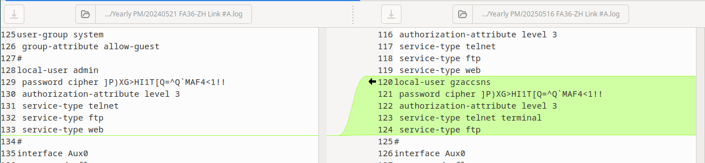
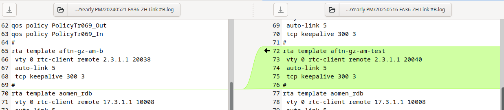
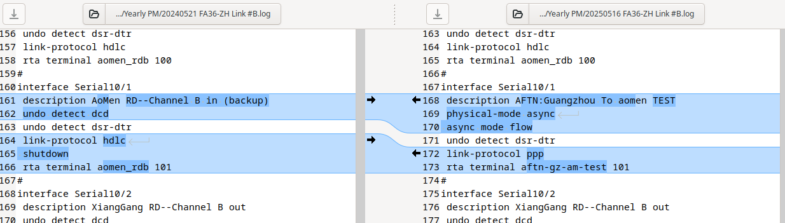
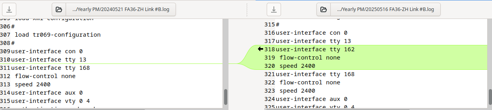

- [Last Month]([[Monthly/2025-04]]) << | >> [Next Month]([[Monthly/2025-06]])
- ## 📌Outstanding {{renderer :todomaster}}
- ## Tasks and Issues of the Month {{renderer :todomaster}}
	- TODO [[Drill]] `[[ATIS]]` , at `9:00`[[Raymond]]
	  date:: [[2025-05-26 Mon]]
	- DONE [[MRM meeting]] at `3:00 MP`
	  date:: [[2025-05-21 Wed]]
	- DONE Replaced Master CPU [[LTC212]] on receiver of [[LT31]] [[RWY-MID]], due to config lose under certain conditions for 3 times
	  date:: [[2025-05-15 Thu]]
	- DONE Issue [[DIR]] & [[IMO]] for [[AWOS]] outdoor signal cabinets
	  date:: [[2025-05-16 Fri]]
	  remark:: Requested from E&M. They will arrange for the solution.
	- TODO [[Audit#ISO 9001]]
	  date:: [[2025-05-26 Mon]]
	- TODO Install [[Power Supply]] on [[IGS]] [[LOC]], wait for PM downtime
	  date:: [[2025-07-01 Tue]]
	  remark:: IMO for a new one in place of the SMPS700, if this one works.
	- DONE [[LOC Farfiield Antenna]] lower mounting was displaced
	  date:: [[2025-05-09 Fri]]
	- TODO [[AWOS]] [[Daily PM]] changes to [[New]] [[AWOS]]
	  date:: [[2025-04-15 Tue]]
		- TODO Unable to print ==Event Monitor== warning or alarm
		- TODO Metar related alarms need to be cleared
	- {{embed ((678a1ce7-f2f1-43e7-8be8-88351b78d732))}}
- ## Weekly PM {{renderer :todomaster}}
  collapsed:: true
	- DONE [[Monday Routines]] #w01 #aaron 
	  done:: #{"{"}
	  date:: [[2025-05-06 Tue]]
	- DONE [[ILS]] `Weekly`, 📄Monitor Printouts #w01
	  date:: [[2025-05-06 Tue]]
	- DONE [[VCS]] `Weekly` #w01
	  date:: [[2025-05-07 Wed]]
	- DONE [[ILS]] `Weekly` ,  🏠️Site Visit #w01
	  done:: #{"{"}
	  date:: [[2025-05-07 Wed]]
	- DONE  ==Weekly PM Plan== #w01 #aaron 
	  date:: [[2025-05-08 Thu]]
	- DONE [[Monday Routines]] #w02 #aaron 
	  done:: #{"{"}
	  date:: [[2025-05-12 Mon]]
	- DONE  [[ILS]] `Weekly`, 📄Monitor Printouts  #w02
	  date:: [[2025-05-12 Mon]]
	- DONE  [[VCS]] `Weekly` #w02
	  date:: [[2025-05-13 Tue]]
	- DONE  [[ILS]] `Weekly` ,  🏠️Site Visit #w02
	  done:: #{"{"}
	  date:: [[2025-05-14 Wed]]
	- DONE  ^^Weekly PM Plan^^ #w02 #aaron 
	  date:: [[2025-05-15 Thu]]
	- DONE [[Monday Routines]] #w03 #aaron 
	  done:: #{"{"}
	  date:: [[2025-05-19 Mon]]
	- DONE [[ILS]] `Weekly`, 📄Monitor Printouts #w03 
	  date:: [[2025-05-19 Mon]]
	- DONE [[VCS]] `Weekly` #w03
	  date:: [[2025-05-20 Tue]]
	- TODO [[ILS]] `Weekly` ,  🏠️Site Visit #w03
	  done:: #{"{"}
	  date:: [[2025-05-23 Fri]]
	- TODO ^^Weekly PM Plan^^ #w03 #aaron 
	  date:: [[2025-05-22 Thu]]
	- TODO [[Monday Routines]] #w04 #aaron 
	  done:: #{"{"}
	  date:: [[2025-05-26 Mon]]
	- TODO [[ILS]] `Weekly`, 📄Monitor Printouts #w04
	  date:: [[2025-05-26 Mon]]
	- TODO [[VCS]] `Weekly` #w04
	  date:: [[2025-05-27 Tue]]
	- TODO [[ILS]] `Weekly` ,  🏠️Site Visit #w04
	  done:: #{"{"}
	  date:: [[2025-05-28 Wed]]
	- TODO ^^Weekly PM Plan^^ #w04 #aaron 
	  date:: [[2025-05-29 Thu]]
- ## Monthly PM {{renderer :todomaster}}
  collapsed:: true
	- ### [[VCS]] Monthly PM {{renderer :todomaster}}
	  labor:: 24 hours
		- DONE [[VCS]] `Monthly` - 📞Line check & Save config
		  done:: #{"{"}
		  date:: [[2025-05-06 Tue]]
		  labor::  4 x 4 hours
		- DONE [[VCS]] `Monthly` -==Form== 
		  done:: #{"{"}
		  date:: [[2025-05-12 Mon]]
		  labor::  2 x 4 hours
	- ### [[IGS]] Monthly PM {{renderer :todomaster}}
	  labor:: 32 hours
		- DONE [[IGS]] `Monthly` PM - 🏠️Site
		  done:: #{"{"}
		  date:: [[2025-05-14 Wed]]
		  labor:: 4 x 4 hours
		- DONE [[IGS]] `Monthly`  ==DME history dump & sync time== 
		  done:: #{"{"}
		  date:: [[2025-05-21 Wed]]
		  labor::  4 x 4 hours
	- ### DONE [[FA36]] monthly 
	  done:: #{"{"}
	  date:: [[2025-05-13 Tue]]
	  labor:: 16 hours
	- ### [[ILS]] Monthly PM {{renderer :todomaster}}
	  labor:: 32 hours
		- DONE [[ILS]] -`Monthly`, Record DC Voltages on site 
		  done:: #{"{"}
		  date:: [[2025-05-07 Wed]]
		- DONE [[ILS]]-`Monthly`, Battery Voltages on site 
		  done:: #{"{"}
		  date:: [[2025-05-07 Wed]]
		  labor:: 1 x 4 hours
		- TODO [[ILS]] `Monthly`, LOC Ground Check 
		  done:: #{"{"}
		  date:: [[2025-05-23 Fri]]
		  labor:: 4 x 4 hours
		- DONE [[ILS]] `Monthly`, MIT & Shutdown Tests 
		  done:: #{"{"}
		  date:: [[2025-05-09 Fri]]
		  labor:: 4 x 4 hours
		- TODO [[ILS]] -`Monthly`, Sync Date/Time on `RCSE` 
		  done:: #{"{"}
		  date::
		- TODO [[ILS]] `Monthly`, ==Form== 
		  done:: #{"{"}
		  date::
	- ### [[DVOR]] Monthly PM {{renderer :todomaster}}
	  labor:: 16 hours
		- TODO [[DVOR]] `Monthly`, Site Visit
		  done:: #{"{"}
		  date::
		  labor:: 1 x 4 hours
		- DONE [[DVOR]] `Monthly`, Changeover & Parameter Printouts
		  done:: #{"{"}
		  date:: [[2025-05-19 Mon]]
		  labor:: 4 x 4 hours
			- DONE 1. Parameter Printout -A
			- DONE 2. Changeover
			- DONE 3. Parameter Printout -B
			- DONE 4. Record DC Voltage on ADRACS
	- ### [[AWOS]] Monthly PM {{renderer :todomaster}}
	  labor:: 48 hours
		- DONE [[AWOS]] `Monthly`, Windows Cleaning -Platform Truck🚛
		  done:: #{"{"}
		  date:: [[2025-05-15 Thu]]
		  laobr:: 4x 8 hours
		- TODO [[AWOS]] `Monthly`, Ground Equipment
		  done:: #{"{"}
		  date:: [[2025-05-22 Thu]]
		  labor:: 4 x 4 hours
		- TODO [[AWOS]] `Monthly`, ==Form== 
		  done:: #{"{"}
		  date:: 
		  labor:: 4 x 4 hours
- ## ❌-Monthly Routines {{renderer :todomaster}}
	- ### DONE [[FA36]] Yearly,  Config upload to vWork and Q drive
	  date:: [[2025-05-16 Fri]]
	  labor:: 16 hours
	  remark:: Modifications on ZH Net A&B: for New AMHS, changed by Zhuhai
	  collapsed:: true
		- 
		- 
		- 
		- 
	- DONE [[VCS]] `2-Monthly` PM 
	  done:: #{"{"}
	  date:: [[2025-05-16 Fri]]
	  labor:: 16 hours
	- ### [[ILS]] 3-Monthly PM {{renderer :todomaster}}
	  labor:: 48 hours
		- DONE [[ILS]]  `3-Monthly`, Apply for NOTAM, a week in advance 
		  done:: #{"{"}
		  date::
		- TODO [[ILS]]  `3-Monthly`, LLZ Ground Check Points 
		  done:: #{"{"}
		  date:: [[2025-05-23 Fri]]
		- DONE [[ILS]]  `3-Monthly`, LLZ & GP Power Measurements 
		  done:: #{"{"}
		  date:: [[2025-05-09 Fri]]
		- TODO [[ILS]]  `3-Monthly`, LLZ ADU Visual Check
		  done:: #{"{"}
		  date::
		- TODO [[ILS]]  `3-Monthly`, Parameter Printout Tx-1
		  done:: #{"{"}
		  date:: [[2025-05-23 Fri]]
		- DONE [[ILS]]  `3-Monthly`, Parameter Printout Tx-2
		  done:: #{"{"}
		  date:: [[2025-05-08 Thu]]
		- TODO [[ILS]] `3-Monthly`, ==Form== 
		  done:: #{"{"}
		  date::
- ## TS {{renderer :todomaster}}
	- DONE [[Site Cleaning]] (2nd Wednesday) 
	  done:: #{"{"}
	  date:: [[2025-05-14 Wed]]
	- DONE ⛑️Workplace Safety -ISO45001 `FCOHSP9.1.1-03, FV-01`
	  done:: #{"{"}
	  date:: [[2025-05-21 Wed]]
	- DONE 🪜Ladder & Tools Check `FCOHSP9.1.1-04, FV-01` (==Odd Months Only==) 
	  done:: #{"{"}
	  date:: [[2025-05-21 Wed]]
- ## End of Month {{renderer :todomaster}}
	- TODO Generate PM schedule📅 for the coming month
	  done:: #{"{"}
	- TODO [[Review CM Status]]
	  
	  remark:: Verify `Failure Code` is present on every CM.
- ## Start of Month {{renderer :todomaster}}
	- DONE Gen TS for ==⛑️Workplace Safety== & ==🪜Ladder==
	- DONE Initialize ==Daily PMs== on [[Maximo]]
	- DONE Verify `AWOS` daily backup logs. (Soft link on maintenance PC to TCD workstation)
	- DONE Check `PM Incomplete from Last Month` on Maximo
	- DONE Complete PM last month
	- DONE Complete TS las month
	- DONE Complete CM
	- DONE Initiate PM (Choose multiple W.O. -> "Select Records")
	- DONE Arrange Dates for PMs of The Month
- ## Future Issues (==To move over==)
	- TODO Replace foundation of [[LT31]] receiver on [[RWY16]]
	  date:: [[2025-06-01 Sun]]
	- TODO [[FD70]] [[Training]] by [[Vaisala]]
	  date:: [[2025-06-04 Wed]]
	- TODO Apply for course & test of [[職安卡]]
	  date:: [[2025-10-01 Wed]]
	- TODO [[Flight Check]] - [[ILS]] & [[DVOR]]
	  date:: [[2025-10-07 Tue]]
- ## Members Absent {{renderer :todomaster}}
	- TODO [[Vincent]] on [[AL]]
	  date:: [[2025-05-26 Mon]]