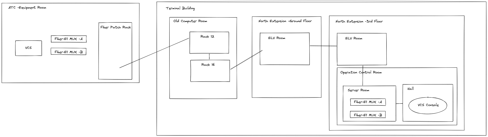
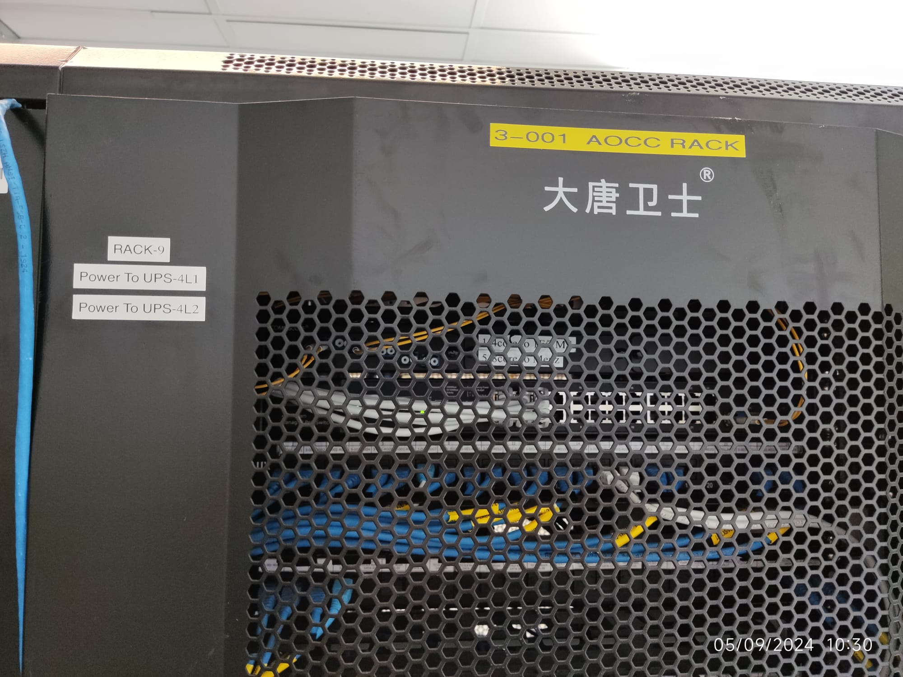
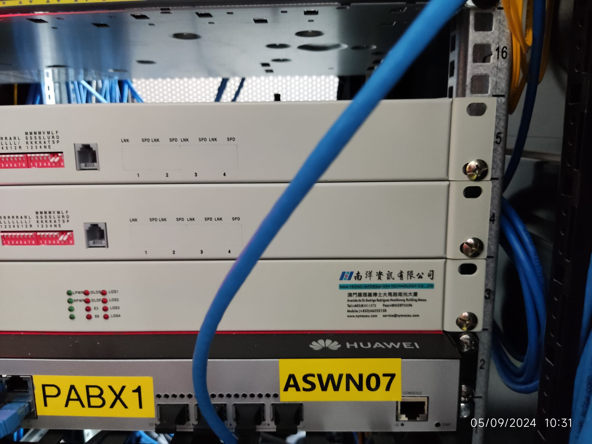
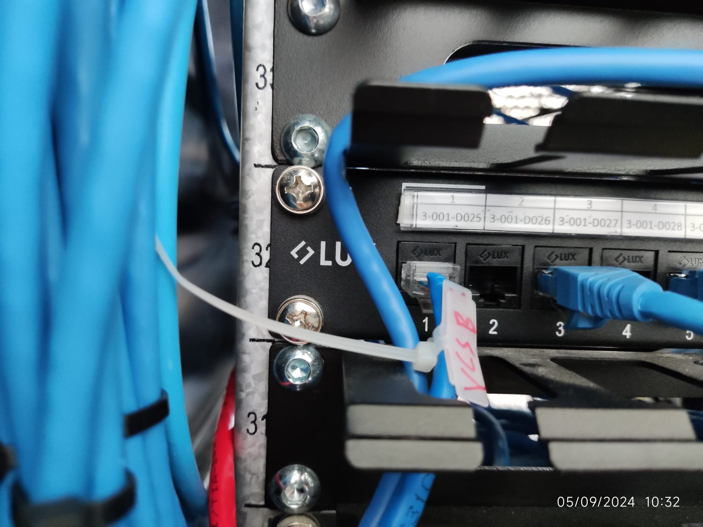
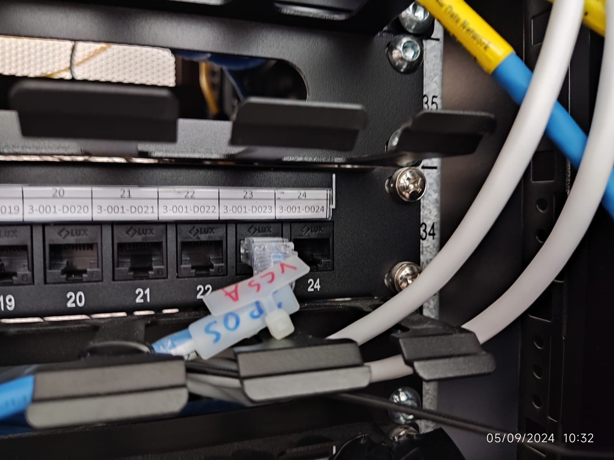
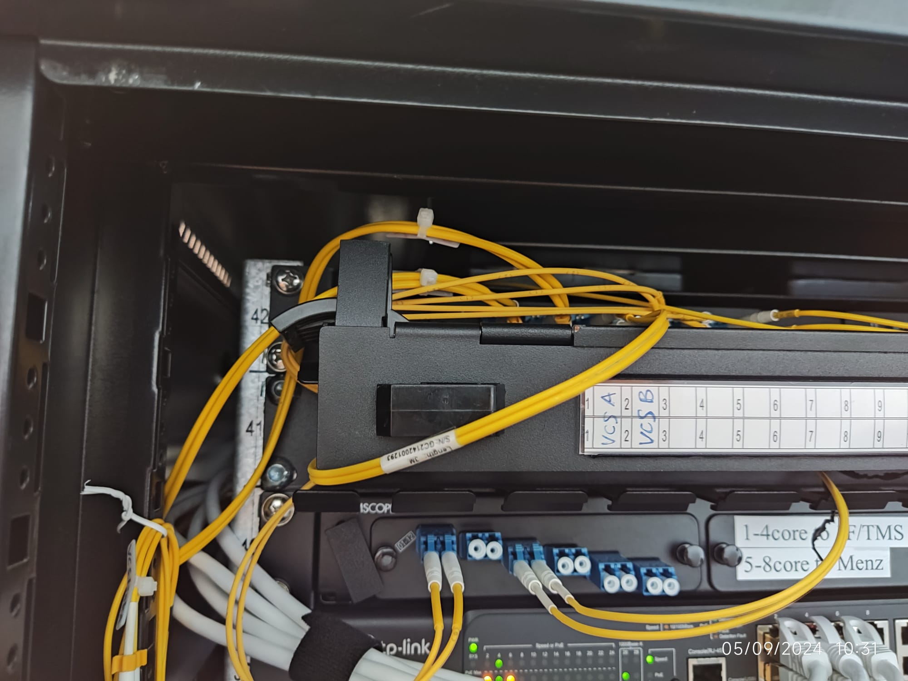

tags:: VCS, AOCC, PTB, IAMC
wo:: cwo23227

- ## Preparation
- ### Material to Order
	- A new VCS Console, ==no longer available==
- DONE 2 x `8E1 PDH Fiber Multiplexer`
- DONE 1 x `4E1 PDH Fiber Multiplexer`
- DONE LAN Cable Patch
	- 10MT A-to-B patch on Maximum might be useful depending on the actual distance between Console and the socket.
- DONE 4 pcs of Power strip
	- 2 for Fiber MUX
	- 1 for VCS Console
- DONE Fiber patch
- #### The Full Path
  collapsed:: true
	- 
- ### Rack allocation
  collapsed:: true
	- 
	- 
	- 
	- 
	- 
- ## Log
- ### [[2024-01-11 Thu]] Done! -But, not what they want?
  collapsed:: true
	- [[Nick]] made 2-types of E1 cables: MUX - Console and MUX - VCS Core
	- [[Aaron]], [[Eric]], [[Karl]] and [[Nick]]
	- [[Eric]] borrowed 4 pairs of 15-meter(10-meter will do, but they've only got 15-m ones) LC-LC fiber path cables from [[Andy]] for connection between 8-port MUX and the fiber rack in ATC.
		- The fiber port model are different between 4-port(`SC`) and 8-port MUX(`LC`).
		- Some some of the fiber patches already connect were not fit for the 8-port MUX. And need to redo.
	- Installed the spare console in control room at PTB 3F.
	- 2 pairs of 8-port MUX are used for network A and B. The 4-port pair is left there as spare.
- ### [[2024-01-08 Mon]]  Testing 4 new 8-port fiber MUX at ATC
	- Those Mux have a plugable  fiber module with blue or yellow mark. And only can those Mux with different color can connect with each other, while the ones with same color fiber module failed to communicate.
	- And the existing 4-port Mux can communicate with the new one with ==blue== fiber module.
- ### [[2023-09-21 Thu]] Site Survey
	- Visiting the `Control Room` at PTB 3F