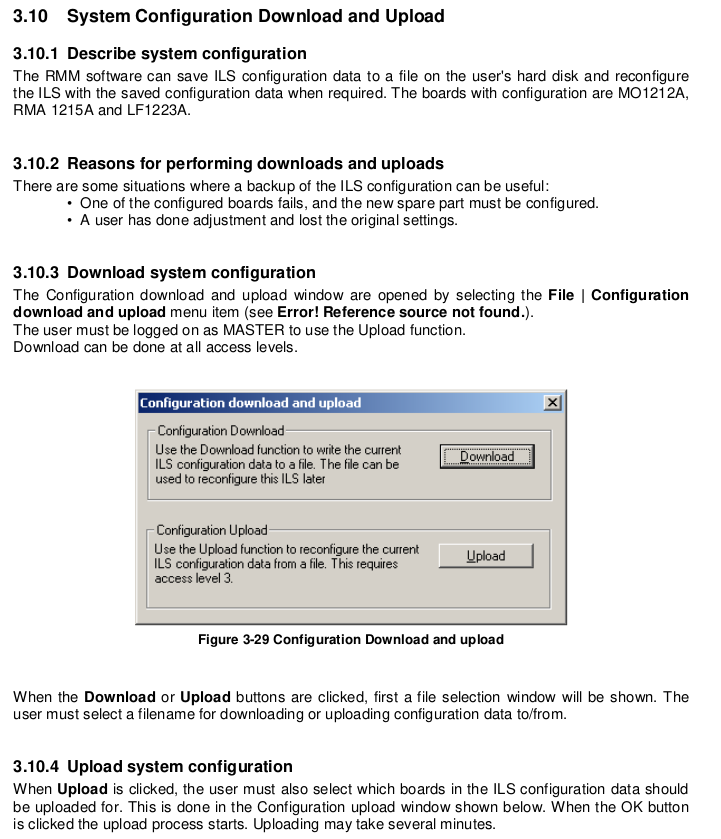
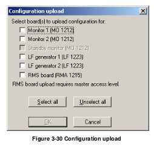
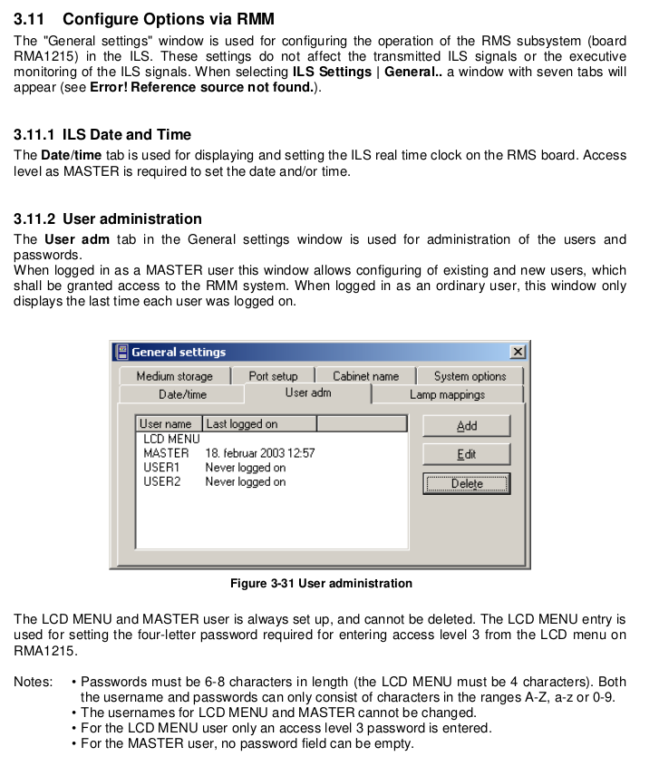
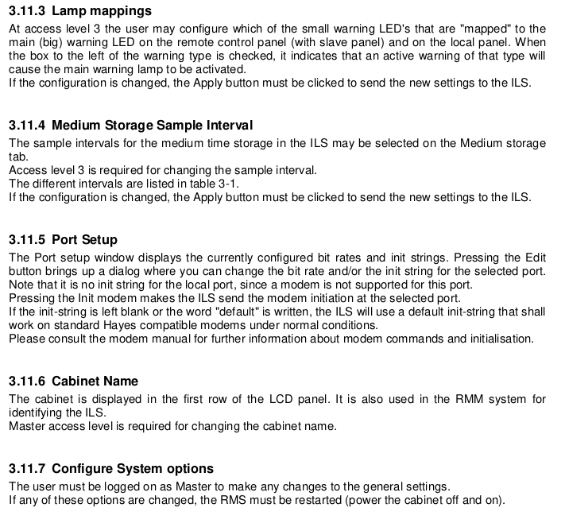
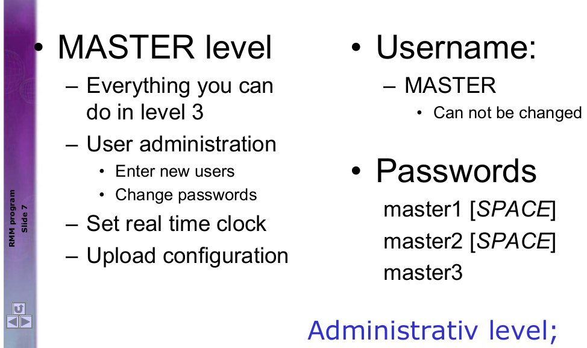
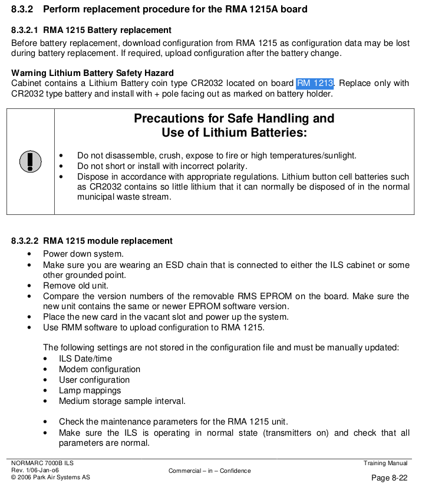

### Steps:
	- Download system Configuration: `File -> Configuration download and upload` then Download
	  logseq.order-list-type:: number
	- Screen capture: `ILS Settings -> General`
	  logseq.order-list-type:: number
	- Turn off [[LOC]] and switch off the power via the 2 switches on top of the equipment rack.
	  logseq.order-list-type:: number
	- Unplug RAM1215A (the one with a display)
	  logseq.order-list-type:: number
	- Replace [[CR2032]]
	  logseq.order-list-type:: number
	- Switch on the 2 power and turn on [[LOC]]
	  logseq.order-list-type:: number
	- Normally, it does ==NOT== need to upload configure.
	  logseq.order-list-type:: number
	- Check monitor readings and compare configurations.
	  logseq.order-list-type:: number
-
- ### Backup & Restore configuration
  collapsed:: true
	- #### System config
		- 
		- 
	- #### Take screen shots to backup: Config Options via RMM
		- 
		- 
- ### Location: on `RM 1213` on `RMA 1215A`
	- 
	- 
	- 
	-