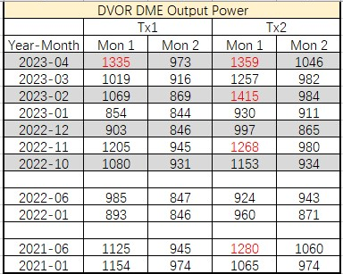

icon:: 👨‍⚕️

## Current issues
- ### [[ILS]]
	- GP ==CRS Width DDM== [Tx-1: 17.1; Tx-2: 18.6]
	- GP & DVOR DME output power issues
		- [[🐞CM -GP DME Output power is too low]]
- ### [[DVOR]]
	- DVOR output power inconsistence & too high lately:
	  | Date | Tx1 -Mon 1 | Tx1 -Mon 2 | Tx2 -Mon 1 | Tx2 -Mon 2 |
	  | ---| ---| ---| ---| --- |
	  | 2021-11 | 1176w | 924w| 1175w | 1005w |
	  | 2023-01 | 833w| 811w| 912w | 892w |
	  | 2023-03 | 991w | 900w | 1232w | 962w |
	- 
- ### [[IGS]]
	- IGS DME Output Power Difference Larger Than 10w
		- Ref: TS 608628
## Followup
## Logs
- Pre-meeting in CAM North Extension Level-3 meeting room. -[[2023-01-16 Mon]]